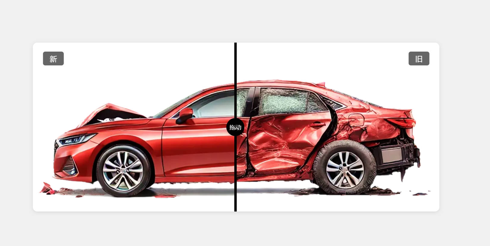

# 🖼️ 拖拽滑块对比图片差异 (Image Compare Slider)

🎮 原生JS实现的拖拽滑块对比功能，支持鼠标和触控操作

## 📸 预览

## 🚀 功能特点
- 🌈 **多模式交互**  
  🖱️ 支持鼠标拖动 | 📱 触摸屏手势操作  
  🎯 点击任意位置快速定位 | ✨ 滑动无延迟
- 🌍 **响应式设计**  
  📐 自适应不同屏幕尺寸 | 🎨 极简滑块UI设计

## 🕹️ 交互指南
### 👇 拖动模式
1. 🖱️ **桌面端**  
   - 长按中间滑块自由拖动
2. 📱 **移动端**  
   - 单指滑动分隔线

### 💡 点击模式
- 🎯 点击图片任意位置自动定位

## 📸 演示效果
copy整个项目代码到本地, 然后在浏览器中打开index.html即可

## ⚠️ 注意事项
+ 建议使用相同尺寸的图片以获得最佳效果
+ 图片大小建议控制在合理范围内以保证加载性能
+ 触摸设备上需要禁用页面缩放以获得最佳体验

## 喜欢的话给个⭐️吧